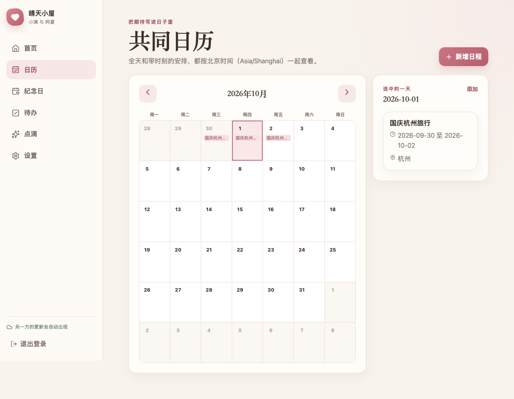
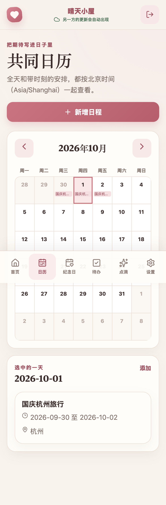

<div align="center">

<h1>有归</h1>

<h3>两个人的日常，记在有归。</h3>

<p>私密、轻松、一起维护的线上生活空间。每个小屋只属于两位成员，资料由你们自己掌握。</p>

<p>
  <a href="https://github.com/maxma615/yougui-couple-home/stargazers"></a>
  <a href="https://github.com/maxma615/yougui-couple-home/network/members"></a>
  <a href="LICENSE"></a>
  <a href="https://nodejs.org/"></a>
</p>

<br />

<table>
  <tr>
    <td></td>
    <td></td>
  </tr>
</table>

<sub>界面截图使用隔离测试账号与虚构日程；项目目前提供自托管代码，没有官方托管实例。</sub>

</div>

## 一起把日子过得有迹可循

有归把纪念日、共同待办、点滴照片和日历放进一个双人空间。两位成员使用各自账号，通过一次性邀请加入同一个小屋；新增和修改会同步给对方，发生并发编辑时会保留草稿，方便核对后再处理。

| 💞 两人共用 | 📅 一起安排 | 📷 留下点滴 | 🔒 自己掌握 |
| --- | --- | --- | --- |
| 独立账号，一间小屋最多两位成员 | 纪念日、待办、共同日历 | 私密照片和生活记录 | 自托管 PostgreSQL 与照片存储 |

### 让每天的小事都好找

- **共同日历**：全天跨日事项按包含结束日显示；带时刻事项统一按上海时间查看。
- **及时更新**：对方的修改会自动出现；网络中断时保留编辑内容，版本冲突可比较后重试。
- **私密邀请**：一次性邀请链接用于加入第二位成员；不开放第三位成员加入。
- **完整备份**：数据库和照片作为同一备份集校验；恢复只写入空数据库与空附件目录。
- **独立运行**：与研笺学术工作台分开部署，不共享账号、数据库或资料。

## 本地开发

需要 Node.js 24 或更新版本、PostgreSQL 18，以及同主版本的 `pg_dump` 和 `pg_restore`。

```sh
npm ci --cache .local/npm-cache
cp .env.example .env.local
```

在 `.env.local` 中填写数据库地址、绝对附件目录、`APP_ORIGIN=http://127.0.0.1:3000` 和独立的随机 `SESSION_SECRET`。然后运行：

```sh
npm run migrate
npm run init-admin -- --email you@example.com --display-name 你的名字
npm run dev
```

初始密码会在终端安全提示中输入，不要把密码写入命令行参数。打开 `http://127.0.0.1:3000` 登录后创建小屋，并在设置页生成邀请链接。

## 自行部署

有归提供 Docker Compose 与 Caddy 配置。准备好指向服务器的域名和 80/443 端口后，在部署主机执行：

```sh
cp .env.compose.example .env
# 为 POSTGRES_PASSWORD 和 SESSION_SECRET 分别生成独立的随机十六进制密钥
docker compose up -d --build
docker compose exec app npm run init-admin -- --email you@example.com --display-name 你的名字
```

部署前在 `.env` 中填写 `APP_DOMAIN`、匹配实际访问地址的 `APP_ORIGIN` 和两份不同的随机密钥。不要提交 `.env`；Caddy 会为域名配置 HTTPS。备份、恢复、升级和故障处理步骤见[运维手册](docs/operations.md)。公网部署需要你自己的服务器与域名，本仓库不会创建或托管线上实例。

## 验收记录

当前本地验收包含 **120 项单元/集成测试**、**30 项浏览器测试**、生产进程重启持久化和空环境恢复。测试环境为 macOS、PostgreSQL 18、桌面 Chromium 与 iPhone 尺寸 WebKit；浏览器模拟尺寸不能替代真实手机验收，也不代表已经在公网部署。

- [首版本地验收记录](docs/m2-acceptance.md)
- [生产部署、备份与恢复](docs/operations.md)
- [开发机 PostgreSQL 运行方式](docs/postgres-runtime.md)

常用验证命令：

```sh
npm test
npm run typecheck
npm run build
npm run check:secrets
npm run check:clean-build
npm run test:persistence
npm run test:e2e
bash tests/scripts/run-empty-restore.sh
```

## Star History

[](https://www.star-history.com/#maxma615/yougui-couple-home&Date)

## License

[MIT](LICENSE) © 2026 有归 contributors. 第三方依赖及其他第三方内容仍受其各自许可证约束。
