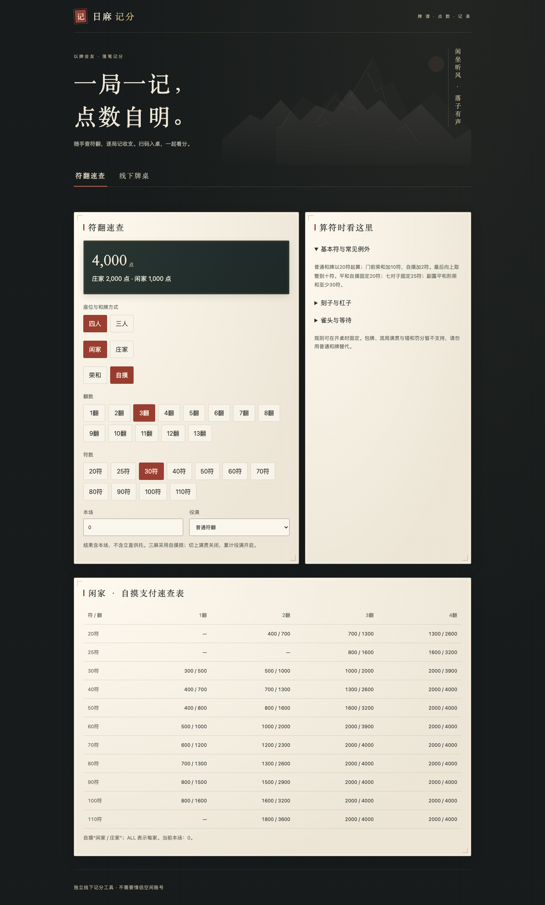
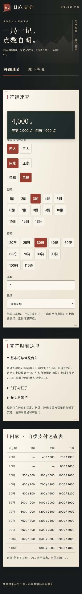

# 日麻记分 · 独立麻将应用

给线下日本麻将使用的手机工具：快速查符翻点数，扫码入桌，逐局记录各家收支，汇总每圈和整场。

这是独立运行的应用，有自己的进程、端口、SQLite 数据库和成员身份；**不需要启动情侣空间，不读取情侣空间账号或资料**。源码暂与有归放在同一仓库，部署可以完全分开。用户已确认现有联机与电脑牌桌以后再迁移。

## 中国风界面

墨色山景、竖排题签、宋体标题与朱砂印章；符翻、点数与逐局记录放在浅色纸页上，配纸纹和细角框。选中项用朱砂色突出，输赢数字保持清晰。算点结果固定在选择区上方；小屏上的按钮保留足够点按面积。





## 功能

- 庄家／闲家、荣和／自摸、符翻速查表，满贯至多倍役满。
- 四人和三人线下记分。本场、立直供托、连庄、换庄、荒牌听牌罚符、途中流局。
- 多人荣和分别记分，供托归头家；四麻三家荣和按途中流局记录。
- 二维码邀请、成员昵称与座位。桌主可以代填没有手机的玩家；扫码成员查看收支，只有桌主可以提交与撤回。
- 逐局历史、每圈汇总、累计点数、撤回最近记录、结束牌局和最近牌桌列表。
- 数据库事务、重复请求去重、并发版本检查，服务重启后保留记录。

输入双方确认的符翻，不自动识别牌型和役。宝牌不能单独形成役。包牌、流局满贯、错和罚分、终局顺位马点暂不支持；不要使用普通和牌代替。结束时未领取的供托继续单独显示，不擅自分配。

规则按桌保存：四麻25000／三麻35000起点；默认不切上满贯、开启累计役满。三麻自摸损，本场荣和200／自摸每家100；荒牌罚符总额3000。实际雀魂当前规则没有登录客户端逐项核验，此版本不宣称完全复刻雀魂。

## 独立启动

需要 Node.js 24+。从有归仓库根目录进入本目录：

```sh
cd mahjong-room
npm ci --cache .local/npm-cache
cp .env.example .env
npm start
```

打开 `http://127.0.0.1:3200/`。运行数据默认保存在本目录 `.local/data/`，不进 Git；上线时把 `DATA_DIR` 指向单独持久化目录。无需 PostgreSQL、Next.js、情侣空间或雀魂账号。

手机扫码需要所有人的设备都能访问 `APP_ORIGIN`。本机回环地址无法给另一台手机访问。局域网测试可设 `HOST=0.0.0.0`、`APP_ORIGIN=http://本机局域网IP:3200`；公网使用可信 HTTPS。`APP_BASE_PATH=/riichi` 可以部署到既有网站的独立路径，反向代理应保留路径。

身份由当前浏览器的 HttpOnly Cookie 保存90天；昵称不是经过验证的微信身份，清除 Cookie 或更换设备不会自动恢复桌主身份。邀请码允许加入空座位，不授予桌主权限；收藏链接、保留浏览器会话后可回到原桌。正式微信小程序需要另外接入微信登录。

## 容器部署

```sh
# .env 中 APP_ORIGIN 配置为真实公网 HTTPS 源站。
docker compose up -d --build
```

容器只在本机3200端口监听，前置 HTTPS 代理自行配置；`score_data` 是独立卷。默认限制0.25 CPU和128 MiB内存。这是配置预算，尚未在 ECS 实测；不要对真实资料自动生成或下载备份。小程序需要备案域名、合法 HTTPS request 域名、AppID、微信服务端登录和小程序码，网页二维码不能冒充小程序码。

## 检查

```sh
npm test
npx playwright install chromium webkit
npm run test:browser
```

测试只用合成昵称和临时数据库。浏览器截图在 `.local/browser/`，不提交运行数据。测试覆盖真实 HTTP 权限、来源校验、数据库重启、并发、幂等、计分与撤回，浏览器流程还将二维码截图解码后在另一个独立会话加入。

[实现设计](docs/design.md) · [验收状态](docs/acceptance.md) · [下一阶段微信小程序](docs/wechat-plan.md)
